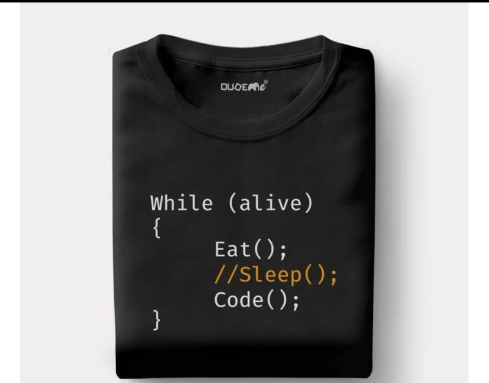
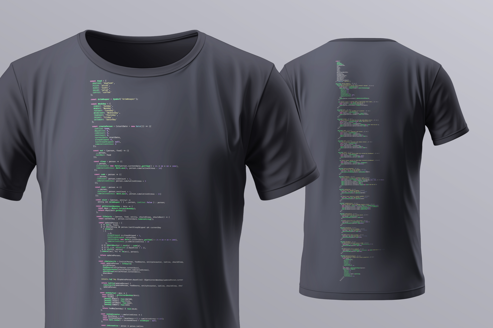

# Person Simulator

They code, they eat, they skip sleep and then they die.

## This is a joke

... about a novelty T-Shirt that had poorly formed code that did not satisfy a seasoned developer regarding its testability and its implied use of global scope, among other things:



## The solution (the actual joke)

Make a better T-Shirt to satisfy the rigors of modern best practices in software development.



## The code

The code is a simple simulation of a person that codes, eats, sleeps and dies.

## How to install
  
```bash
npm install
```

## How to run

```bash
node main.js
```

Example output:

```bash
Day 1: Wednesday - Ate salad, Slept, Coded, Stress: 5
Day 2: Thursday - Ate salad, Slept, Coded, Stress: 5
Day 3: Friday - Ate salad, Slept, Coded, Stress: 5
Day 4: Saturday - Ate pizza, Skipped sleep, Rested, Stress: 10
Day 5: Sunday - Ate sushi, Skipped sleep, Rested, Stress: 15
Day 6: Monday - Ate sushi, Slept, Coded, Stress: 10
Day 7: Tuesday - Ate dogfood, Slept, Coded, Stress: 5
Day 8: Wednesday - Ate salad, Slept, Coded, Stress: 5
Day 9: Thursday - Ate salad, Slept, Coded, Stress: 5
Day 10: Friday - Ate salad, Slept, Coded, Stress: 5
Day 11: Saturday - Ate pizza, Skipped sleep, Rested, Stress: 10
Day 12: Sunday - Ate sushi, Skipped sleep, Rested, Stress: 15
Day 13: Monday - Ate sushi, Slept, Coded, Stress: 10
Day 14: Tuesday - Ate dogfood, Slept, Coded, Stress: 5
Day 15: Wednesday - Ate salad, Slept, Coded, Stress: 5
Day 16: Thursday - Ate salad, Slept, Coded, Stress: 5
Day 17: Friday - Ate salad, Slept, Coded, Stress: 5
Day 18: Saturday - Ate pizza, Skipped sleep, Rested, Stress: 10
Day 19: Sunday - Ate sushi, Skipped sleep, Rested, Stress: 15

Final Report:
{
  daysAlive: 19,
  codeCount: 13,
  restCount: 6,
  currentDate: 'Sun Sep 15 2024',
  sleepSkipped: 6,
  finalStressLevel: 15
}
```

## Development

To run the tests:

```bash
npm test
```

## Make your own T-Shirt

Improve on the code and then run

```bash
node js_to_image_darcula.js
```

to generate a new image to slap on a T-Shirt.  
The template used in the example is not included in project.
